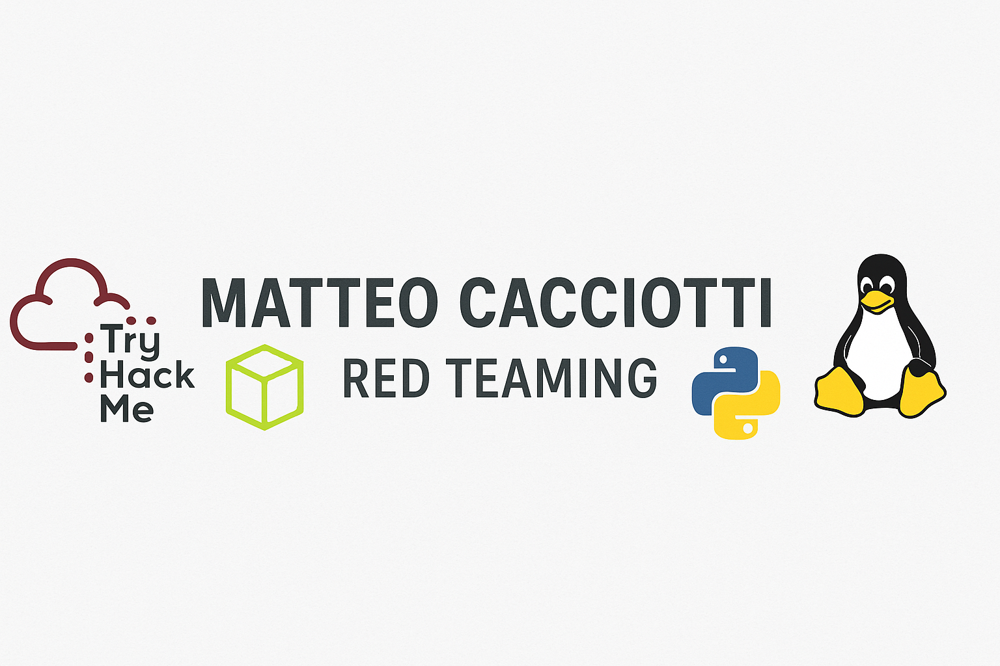

# 🛡️ Cybersecurity & Red Teaming Portfolio

Welcome! This is the personal cybersecurity learning repository of **Matteo Cacciotti**, focused on **Red Teaming**, offensive security, and hands-on technical development.

---

## 🎯 Objective

To become a **Red Team Operator** with strong foundations in networking, Linux, programming, offensive security, and certifications recognized in the cybersecurity industry.

This repository is designed to document, structure, and publish my progress as I build the necessary skills across multiple domains.

---

## 🗂️ Repository Structure

```
cybersecurity-portfolio/
├── 01_foundations/
│   ├── ccst-networking/
│   │   └── images/
│   ├── comptia-security+/
│   │   └── tryhackme-labs/
│   │       └── images/
│   └── linux-essentials/
│       └── images/
├── 02_dev-and-theory/
│   ├── scripting-projects/
│   │   └── images/
│   ├── scripts/
│   │   ├── bash/
│   │   │   └── images/
│   │   ├── c/
│   │   │   └── images/
│   │   └── python/
│   │       └── images/
│   └── theory-roadmap/
│       ├── 01_programming/
│       ├── 02_data-structures/
│       ├── 03_databases/
│       ├── 04_os-architecture/
│       ├── 05_networking/
│       ├── 06_linux/
│       ├── 07_windows-terminal/
│       ├── 08_cybersecurity-overview/
│       ├── 09_labs-practice/
│       └── 10_advanced-tools/
├── 03_offensive-practice/
│   ├── hackthebox/
│   │   └── images/
│   └── tryhackme/
│       └── images/
├── 04_certifications/
│   ├── cbbh/
│   ├── crto/
│   ├── crto-ii/
│   ├── ejpt/
│   └── oscp/
├── 05_language/
│   └── ielts/
├── 06_personal-notes/
├── assets/
└── site/
```

## 📚 Contents

- [01 Foundations](./01_foundations/README.md)
  - [CCST Networking](./01_foundations/ccst-networking/README.md)
  - [Linux Essentials](./01_foundations/linux-essentials/README.md)
  - [CompTIA Security+](./01_foundations/comptia-security+/README.md)
- [02 Dev and Theory](./02_dev-and-theory/README.md)
  - [Scripts](./02_dev-and-theory/scripts/README.md)
  - [Scripting Projects](./02_dev-and-theory/scripting-projects/README.md)
  - [Theory Roadmap](./02_dev-and-theory/theory-roadmap/README.md)
- [03 Offensive Practice](./03_offensive-practice/README.md)
  - [Hack The Box](./03_offensive-practice/hackthebox/README.md)
  - [TryHackMe](./03_offensive-practice/tryhackme/README.md)
- [04 Certifications](./04_certifications/README.md)
  - [CBBH](./04_certifications/cbbh/README.md)
  - [CRTO](./04_certifications/crto/README.md)
  - [CRTO II](./04_certifications/crto-ii/README.md)
  - [eJPT](./04_certifications/ejpt/README.md)
  - [OSCP](./04_certifications/oscp/README.md)
- [05 Language](./05_language/ielts/README.md)
- [06 Personal Notes](./06_personal-notes/README.md)
---

## 📌 On AI Assistance

To ensure full transparency:

> 🧠 All technical content, notes, scripts, and exercises are my own —
> based on personal study, practical labs, and certifications.

> 🤖 I used AI tools solely to support:
> - Organizing the overall structure of this repository
> - Improving clarity, formatting, and readability of notes
> - Editing content for clean publication and professional presentation

This repository reflects my real effort and growth. AI was a tool to **enhance structure and polish**, not to substitute learning or original work.

---

## 🧭 Roadmap Summary

- ✅ CCST Networking (completed)
- ⏳ Linux Essentials + Security+ (by end of year)
- 🔁 Programming & Scripting (after fundamentals)
- 🚀 eJPT + OSCP (next phase)
- 🎯 Advanced Certs: CRTO, CRTO II, CBBH

---

## 🔗 Platforms

[](https://github.com/matteocacciotti)
[](https://tryhackme.com/p/matteocacciotti)
[](https://app.hackthebox.com/profile/2480844)

---

## 📜 License

Content is released under [Creative Commons BY-NC-SA 4.0](https://creativecommons.org/licenses/by-nc-sa/4.0/)

---

## 🙏 Final Note

This repo is the product of continuous study and commitment.
If you're a recruiter, mentor, or learner — feel free to explore, suggest, or collaborate.

