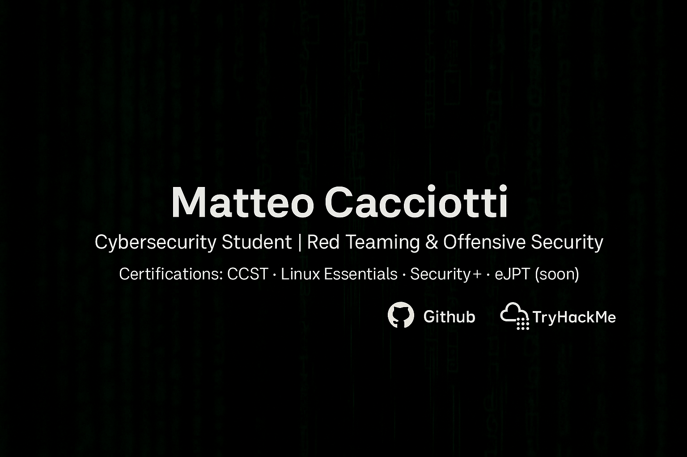

  

# 🛡️ Cybersecurity Portfolio

This repository documents my training and projects as a future cybersecurity analyst focused on red teaming and offensive security.

## 🗂️ Repository Structure

- `01_certifications/` – Notes from cybersecurity certifications (current and future)
- `02_tryhackme/` – TryHackMe exercises and writeups
- `03_scripts/` – Python, C, Bash scripts and future tools
- `04_university/` – Coursework from my Bachelor’s degree in Digital Informatics
- `05_roadmap/` – Personal cybersecurity roadmap based on structured YouTube content

## 📚 In Progress
- 📘 Certifications: CCST Networking, Linux Essentials, CompTIA Security+
- 🎓 University: L-31 Digital Informatics (Pegaso), Year 1 near completion
- 🧪 TryHackMe: Beginner → Offensive Path
- 💻 Languages: Python, C, Bash (learning phase)
- 🔐 Future Goals: eJPT, OSCP (Red Teaming & Offensive Security)

## 📎 Links
- GitHub: [matteocacciotti](https://github.com/matteocacciotti)
- TryHackMe: [https://tryhackme.com/p/matteocacciotti](https://tryhackme.com/p/matteocacciotti)
